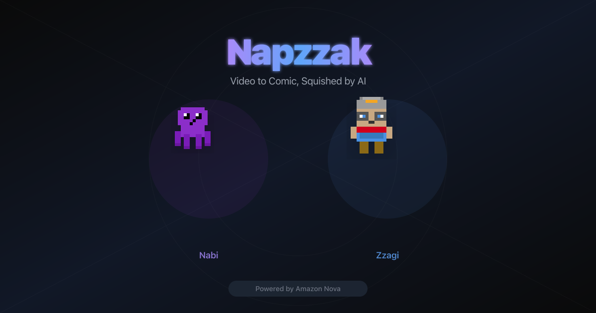

# 납짝 (Napzzak)

> 영상을 업로드하면 AI가 자동으로 스토리 기반 N컷 만화로 변환해주는 서비스

**AWS Nova Hackathon Project**

[English README](./README.md)

---

## 데모

**Live**: https://napzzak.site



---

## 주요 기능

- **영상 → 만화 자동 변환**: 파일 업로드로 AI 만화 생성
- **3단계 Chain-of-Thought 분석**: Nova Pro 기반 대사/행동/스토리 심층 분석
- **반박 검증 게이트**: 6가지 adversarial 질문으로 분석 오류 자동 교정
- **멀티에이전트 패널 분할**: Nova Pro 4단계 분업 (Planner → Consolidator → Descriptor → Reviewer)
- **4가지 그림체**: Graphic Novel / Soft Painting / Flat Vector / 3D Animation
- **이중 언어 대사**: 한국어 ↔ 영어 토글
- **음성 내레이션**: Nova 2 Sonic 대사 음성 재생
- **CSS 대사 오버레이**: AI 텍스트 렌더링 한계를 구조적으로 해결

---

## 기술 스택

| 카테고리 | 기술 |
|----------|------|
| 프레임워크 | Next.js 16 (App Router) |
| 언어 | TypeScript |
| 스타일링 | Tailwind CSS |
| AI (분석) | Amazon Bedrock Nova Pro |
| AI (이미지) | Amazon Bedrock Nova Canvas |
| AI (음성) | Amazon Bedrock Nova 2 Sonic |
| 음성 인식 | Amazon Transcribe (Streaming) |
| 영상 처리 | ffmpeg |
| 스토리지 | Amazon S3 |
| DB | Amazon DynamoDB |

---

## AI 모델 (4개)

| 모델/서비스 | 모델 ID | 역할 |
|-------------|---------|------|
| **Nova Pro** | `us.amazon.nova-pro-v1:0` | Pass 1 (3단계 CoT 분석) + 반박 검증 + Pass 2 멀티에이전트 (4개 에이전트 전체) |
| **Nova Canvas** | `amazon.nova-canvas-v1:0` | 패널별 만화 이미지 생성 (Budget Allocator 프롬프트) |
| **Nova 2 Sonic** | `amazon.nova-2-sonic-v1:0` | 대사 음성 내레이션 (on-demand) |
| **AWS Transcribe** | Streaming API | 영상 대사 추출 + 화자 분리 |

---

## 파이프라인

```
영상 업로드 → S3 저장 → Transcribe 대사 추출 + ffmpeg 키프레임 추출
  → Pass 1: Step A(대사검증) → Step B(행동분석) → Step C(스토리종합)
  → 반박 검증 (6가지 adversarial 질문)
  → Pass 2: P-A(Planner) + P-C(CharConsolidator) 병렬 → P-B(SceneDescriptor) → P-D(Reviewer)
  → Nova Canvas 패널별 이미지 생성 (Budget Allocator)
  → Story JSON 저장 → 프론트엔드 렌더링
```

---

## 시작하기

### 사전 요구 사항

- Node.js 20+
- ffmpeg
- AWS 계정 (Bedrock, S3, DynamoDB, Transcribe)

### 로컬 개발

```bash
git clone https://github.com/importunate-dev/napzzak.git
cd napzzak
npm install
cp .env.local.example .env.local  # AWS 설정
npm run dev
```

### 환경 변수

```
AWS_REGION=us-east-1
AWS_ACCOUNT_ID=<your-account-id>
S3_BUCKET_NAME=napzzak-videos-<account-id>
DYNAMODB_TABLE_NAME=napzzak-jobs-<account-id>
```

---

## 배포 (EC2)

| 항목 | 값 |
|------|-----|
| **서비스 URL** | https://napzzak.site |
| **SSH 접속** | `ssh -i napzzak-key.pem ec2-user@54.156.75.146` |
| **인스턴스** | `t4g.small` (ARM64 Graviton) |
| **리전** | `us-east-1` |
| **도메인** | `napzzak.site` (Route 53 + Gabia) |
| **SSL** | Let's Encrypt (자동 갱신) |
| **AWS 프로필** | `personal` |

### 서버 구성

```
Client → Nginx(:443 SSL) → PM2 → Next.js(:3000) → AWS Services
```

### 배포 명령

```bash
# EC2에서 최초 배포
scp -i napzzak-key.pem -r ./napzzak ec2-user@54.156.75.146:/home/ec2-user/
ssh -i napzzak-key.pem ec2-user@54.156.75.146
bash scripts/deploy-ec2.sh

# 업데이트 배포
ssh -i napzzak-key.pem ec2-user@54.156.75.146
cd /home/ec2-user/napzzak
git pull origin main && npm install && npm run build && pm2 restart napzzak
```

### 운영 명령어

```bash
pm2 logs napzzak        # 로그 확인
pm2 restart napzzak     # 앱 재시작
pm2 monit               # 리소스 모니터링
```

---

## 프로젝트 구조

```
napzzak/
├── src/
│   ├── app/
│   │   ├── page.tsx              # 메인 페이지
│   │   └── api/
│   │       ├── upload/           # 영상 업로드 + 파이프라인
│   │       ├── upload-youtube/   # YouTube URL 업로드
│   │       ├── jobs/[jobId]/     # 작업 상태 폴링
│   │       ├── narrate/          # 음성 내레이션
│   │       ├── restyle/          # 그림체 변경
│   │       └── analyze-story/    # 스토리 분석
│   ├── lib/                      # 핵심 로직 (bedrock, canvas, pipeline, s3, ...)
│   ├── hooks/                    # React 커스텀 훅
│   └── components/               # UI 컴포넌트
├── scripts/
│   └── deploy-ec2.sh            # EC2 배포 스크립트
├── ARCHITECTURE.md              # 상세 기술 아키텍처 문서
└── DEPLOYMENT.md                # EC2 배포 상세 문서
```

---

## 만든 사람들

AWS Nova Hackathon Team — **importunate-dev**
